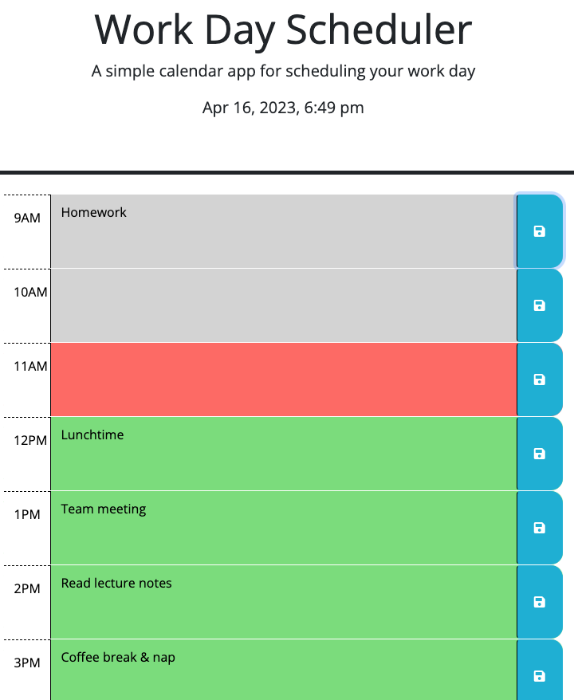

# JS-work-day-scheduler

## Description

Application Link: <https://gh120515.github.io/JS-work-day-scheduler/>

This scheduler web application is a web browser based planner that allows its user to save event for each hour of their workday(9AM - 5PM), according to their daily plan. It was built using HTML, CSS and powered by jQuery, in order to demonstrate my knowledge and proficiency on these languages.

## Usage

 

The scheduler displays time in blocks from 9AM to 5PM (a typical workday), which notes can be entered into each hour. Write your schedule or notes in each field & click on the blue save icon to enter into the planner (don't forget to save, or you will lose your note!).

Each timeblock will display as below depending on the time of the day:
- grey: past
- red: present
- green: future

When your note(s) is saved, it is stored the the local storage of your browser, so they will stay even if you reload the page.

## Credits

Libraries used:
- bootstrap: <https://getbootstrap.com>
- DayJS: <https://day.js.org/>
- jQuery: <https://jquery.com/>

## License

MIT Licensed